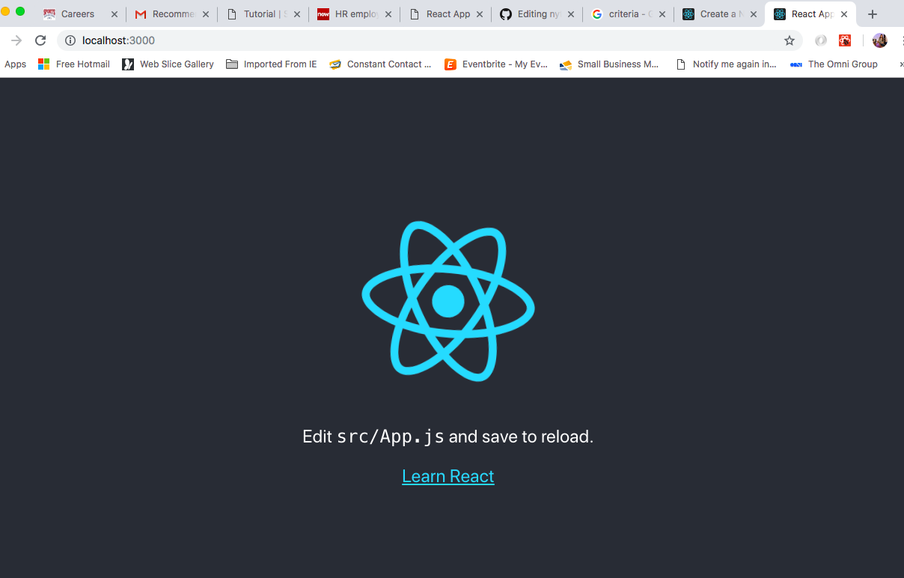
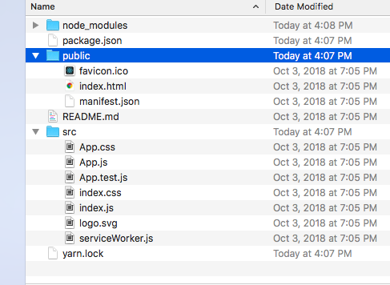
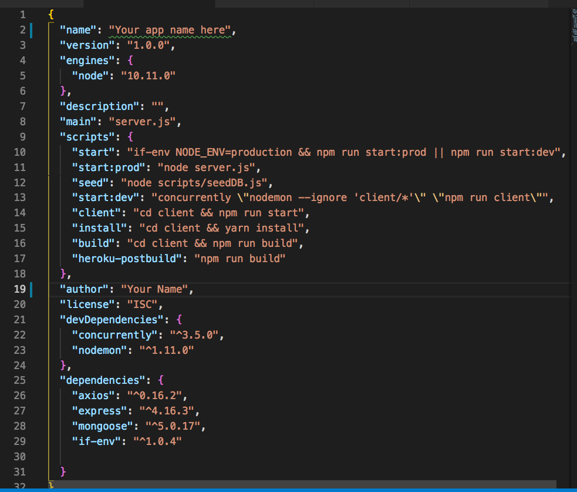
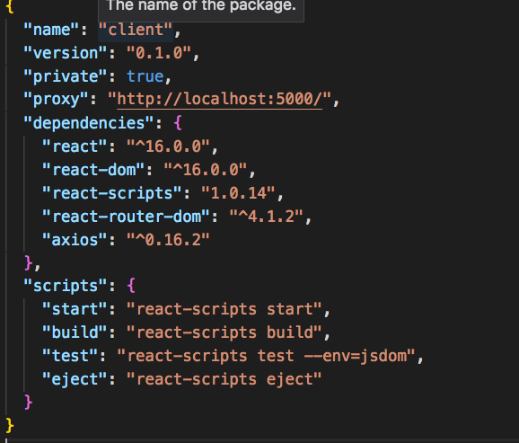
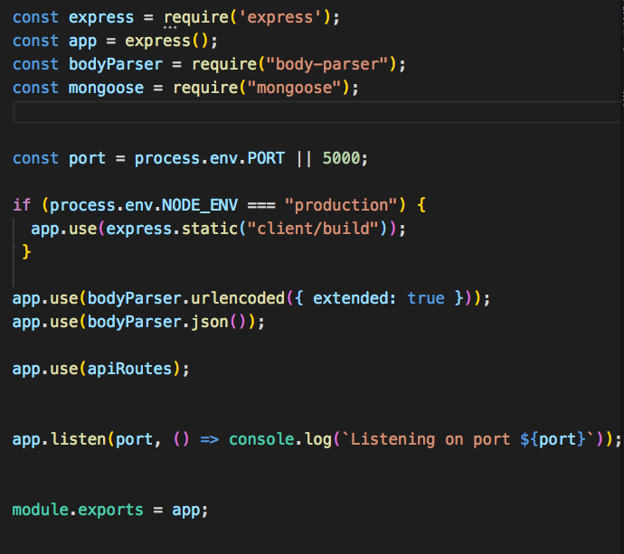

# New York Times Article Find and Save

[Test it here](https://agile-tor-19181.herokuapp.com/) 
This is a MERN (Mongo, Express, React and Node) project that searches The New York Times Search API for articles that meet the search criteria. It also allows the user to save selected articles to a MongoDB database. 

Below are step by step instructions to help you recreate the project yourself. If you have questions, please do not hesitate to reach out. 

### Getting Started ###
I believe the best way to approach this full stack development project is to start with the client-side development. This means starting with react. React is a JavaScript library for building userinterfaces developed by Facebook. Since it is created in JavaScript, you can pass data rich objects throughout your application without slowing down the user experience and the components effortlessly adjust to the screenwidth of the user allowing for a wonderful experience. For more information on React, visit their site [here](https://reactjs.org/).

From terminal create your folder where your project will live. Your file structure is extremely important for this application to work correctly. I like to cd (change directory) into my Desktop for every new project. `cd Destop` is the command I use. 
Once there, you can make a folder/director with the `mkdir <foldername>` command. I've chosen nyt-scrubber for this application, so my command looks like this, `mkdir nyt-scrubber`. 

Next it's time to launch your React application. First cd into the new folder. Use the command `npx create-react-app my-app` to launch the react site. You know you have been successful when you see notes from react on the next steps and you'll see "successfully compiled!" written in green. 

Then cd into my-app folder and run the command yarn start. Within a few moments you will see the React started site up and running. It will look like this: 

It's important to notice that React runs on localhost:3000. This is important to realize because your full stack website will run on two ports. Thus, you have to specify which ports you are using otherwise you will receive errors and your application will not launch. 

Let's take a moment to review the files and folders React install for you and your development experience. . The node_modules are the npm packages react install to give you an effortless development experience. It gives the appearence that your website is already being hosted on a server and it also gives you instantaneous code compiling that allows you to instantly see the changes your code is making to the user experience. If you are planning on adding this project to github, now is the time to create a git ignore folder with the command `touch .gitignore` and add `node_modules` to it. This way, your github won't be bogged down with files. Your package.json has all the information you need to download the files and re-create this project again. 

Next head to your github and start a new repository. After you create the repo, copy the code to connect the folder on your desktop to the repo. This is useful when you run into errors and you need to find the code that worked last.  User the command `git init` to initialize the repo. Then copy this code from github to connect the two directories. `git remote add origin git@github.com:yourname/yourrepo.git git push -u origin master`

Next check which files are being tracked by git with the command `git status`. You want to do this before you do a `git add .` because you want to make sure your node_modules isn't being track and that your gitignore file. If everything is to your liking, then add all your files with `git add .` followed by `git commit -m "enter a useful comment/message here"`. Then finally push your commitment with the command `git push origin master`. At this point, I would check github to make sure your commitment pushed to github. You should see the React readme. If this is your first time using react, then please review these files. 

The next step is to the server side portion of the application. This is the part of the program that will connect to database, pull the informaton from New York Times and create a seemless experience for your users. If you remember looking at the files in the React, you'll notice a file called, "package.json". This file communicates with npm with the commands, "yarn start", and "yarn install", to install the files and initaite the files needed to launch the website. We will have a package.json for the server. This package.json will also launch the package.json in the react files so that you do not need to launch both files. 

Before creating any of the server-side files, move your react files into a folder called, "client". It must be named client because that is the name we will put in the package.json (on the server-side) and it will know to "cd " into that file and launch the react files. 

Use this code for your package.json

 Remember to put your application name and your name in the corresponding fields. 

Next, go into your client-side/react-side package.json, and add the code:

Most likely, you are only adding the proxy line. This is becausae you have to state which port your server-side is running on so that your react application will not launch on that port. If you do, you will see an error, port already in use error. Those are not the exact words, but the error eludes to that issue. 

The code in this file will launch your website and it's also ready for you to deploy to heroku. Using process.env, gives heroku the flexibility it needs to find an open port to run your application. 

## Launch the application
Now it's time to check to see if your application is working from a full stack perspective. Run `npm install` and once all the node modules are ready, run `yarn start`. Your terminal should tell you what port it is listening on because of our console log, "listening on port ${PORT}". Seconds later the client/react website should launch if you do not already have your default browser open. 

## Designing the Components

## Connecting to NYT

## Setting the Routes

## setting the state

## Making the models

## Connecting to Mongo

## Launching on Heroku

