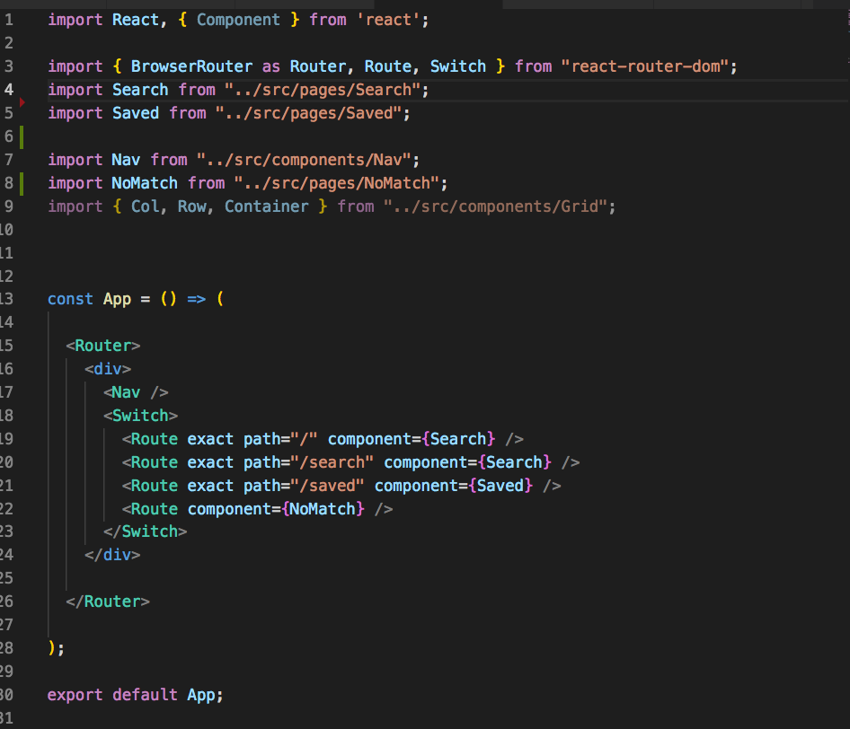

# New York Times Article Find and Save

[Test it here](https://agile-tor-19181.herokuapp.com/) 
This is a MERN (Mongo, Express, React and Node) project that searches The New York Times Search API for articles that meet the search criteria. It also allows the user to save selected articles to a MongoDB database. 

Below are step by step instructions to help you recreate the project yourself. If you have questions, please do not hesitate to reach out. 

### Getting Started ###
I believe the best way to approach this full stack development project is to start with the client-side development. This means starting with react. React is a JavaScript library for building userinterfaces developed by Facebook. Since it is created in JavaScript, you can pass data rich objects throughout your application without slowing down the user experience and the components effortlessly adjust to the screenwidth of the user allowing for a wonderful experience. For more information on React, visit their site [here](https://reactjs.org/).

From terminal create your folder where your project will live. Your file structure is extremely important for this application to work correctly. I like to cd (change directory) into my Desktop for every new project. `cd Desktop` is the command I use. 
Once there, you can make a folder/director with the `mkdir <foldername>` command. I've chosen nyt-scrubber for this application, so my command looks like this, `mkdir nyt-scrubber`. 

Next it's time to launch your React application. First cd into the new folder. Use the command `npx create-react-app my-app` to launch the react site. You know you have been successful when you see notes from react on the next steps and you'll see "successfully compiled!" written in green. 

Then cd into my-app folder and run the command yarn start. Within a few moments you will see the React starter website will be up and running. It will look like this: 

It's important to notice that React runs on localhost:3000. This is important to realize because your full stack website will run on two ports. Thus, you have to specify which ports you are using otherwise you will receive errors and your application will not launch. 

Let's take a moment to review the files and folders React install for you and your development experience. . The node_modules are the npm packages react installs for you to give you an effortless development experience. It gives the appearence that your website is already being hosted on a server and it also gives you instantaneous code compiling that allows you to instantly see the changes your code is making to the user experience. If you are planning on adding this project to github, now is the time to create a git ignore folder with the command `touch .gitignore` and add `node_modules` to it. This way, your github won't be bogged down with these files. Your package.json has all the information you need to download the files and re-create this project again. 

Next head to your github and start a new repository. Click the new button on the upper right side of the website (on your repositories page to build a new repo.. After you create the repo, copy the code to connect the folder on your desktop to the repo. This is useful when you run into errors and you need to find the code that worked last.  Use the command `git init` to initialize the repo. Then copy this code from github to connect the two directories. `git remote add origin git@github.com:yourname/yourrepo.git git push -u origin master`

Next check which files are being tracked by git with the command `git status`. You want to do this before you do a `git add .` because you want to make sure your node_modules isn't being track and that your .gitignore file is working. If everything is to your liking, then add all your files with `git add .` The once red "untracked files" should not be green and "stage for commitment" to github. User the command `git commit -m "enter a useful comment/message here"`. Then finally push your commitment with the command `git push origin master`. At this point, I would check github to make sure your commitment pushed to github. Your terminal should also send you a message that 100/100 of the files were committed to github. You should see the React readme. If this is your first time using react, then please review this readme. It's user friendly and full of great information.

The next step is to the server side portion of the application. This is the part of the program that will connect to database, pull the informaton from New York Times and create a seemless experience for your users. If you remember looking at the files in the React, you'll notice a file called, "package.json". This file communicates with [npm](https://www.npmjs.com/) with the commands, "yarn start", and "yarn install", to install the files and initaite the files needed to launch the website. We will have a package.json for the server. This package.json will also launch the package.json in the react files so that you do not need to launch both files. 

Before creating any of the server-side files, move your react files into a folder called, "client". It must be named client because that is the name we will put in the package.json (on the server-side) and it will know to "cd " into that file and launch the react files. 

Use this code for your package.json

 Remember to put your application name and your name in the corresponding fields. 

Next, go into your client-side/react-side package.json, and add the code:

Most likely, you are only adding the proxy line. This is becausae you have to state which port your server-side is running on so that your react application will not launch on that port. If you do, you will see an error, port already in use error. Those are not the exact words, but the error eludes to that issue. 

The code in this file will launch your website and it's also ready for you to deploy to heroku. Using process.env, gives heroku the flexibility it needs to find an open port to run your application. 

## Launch the application
Now it's time to check to see if your application is working from a full stack perspective. Run `npm install` and once all the node modules are ready, run `yarn start`. Your terminal should tell you what port it is listening on because of our console log, "listening on port ${PORT}". Seconds later the client/react website should launch if you do not already have your default browser open. 

## Designing the Components

Now that we our backend and frontend working, it's time to build some of the presentation components in React. These are components that are for display only. They do not hold/have "state". State is a term by React for the components(another term in React). State holds dynamic data and hosts the changes to the user. When we get to the smart components, we will have the ability to use the word, "this" to help "setState" and render changes to the virtual DOM (React created a JavaScript virtual version of the DOM, and it manipulates the virtual DOM instead of the real DOM so that changes are much faster than typical DOM manipulation. That being said, you should also note that you cannot use jQuery in React because jQuery manipulates the real DOM and not the virtual DOM.  

## Understanding the files from a React Perspective

Building a website in React is somewhat different at first compared to how you build a website with just HTML, CSS and Javascript. First almost all of your files will be written in JSX. It's JavaScript, and all of your files will be in JavaScript, but you'll see elements that have HTML and CSS syntax within them. 

Second, all of your important files will be in your 'src' file. If you want to display anything and have React notice it, it must be in this file. In the public file, you'll see an html page with one 
 with the id of "root". Then notice in the App.js and the Index.js (at the same folder level) target that div. You'll see it here in the files I have for a different project. 
   Another important thing to note is that all JavaScript engines look for an index.js file to read if they are not given a direction. From there, they will be directed. That is why all of the files/components in react have a corresponding index.js file at their same level in the file structure so that they are directed to the correct page. React has set up this index.js and App.js for you. The App.js file is primary point of connection to your JavaScript website, and connecting to what the user will see. App is the parent file and it will recieve all of the information and pass it down to the other files via props. - Unless you choose to code the website in a different format. This is the format given to you by React. Also note that props cannot be passed from child to parent. This is crucial to understand when we start manipulating the state of the project. 
  
 ## Presentation components
 
 To quicken my creation of the website, I have used Bootstrap 4 to help me render the components quickly. To do this, I added Bootstraps CSS link to my index.html page. Use this link the the head of your index.html page `<link rel="stylesheet" href="https://stackpath.bootstrapcdn.com/bootstrap/4.1.3/css/bootstrap.min.css" integrity="sha384-MCw98/SFnGE8fJT3GXwEOngsV7Zt27NXFoaoApmYm81iuXoPkFOJwJ8ERdknLPMO" crossorigin="anonymous">"` 
 
 Disregard the links it tells you to use in the bottom of your page. Those are jQuery scripts and they will not work on the virtual DOM rendered by React. 
 
 Let's start coding! 
 In your src file, make two directories. One for components, and one for pages. In components, make a folder for Jumbotron (and in Jumbotron create an index.js, and a Jumbotron.js). In pages, create a Saved folder and a Search folder. Add a Search.js, and Index.js to the Search folder and in the Saved Folder add a Saved.js, and a Index.js. 
 
 In all of the index.js files use this code `export { default } from "./Jumbotron";` but with the corresponding file you want to export. For example, the index.js file with Search.js will say `export { default } from "./Search"`. This tells React to look in the Search.js file that is in the same directory as the index.js file to launch the code. 
 
 Next in Search.js, Saved.js, and Jumbotron.js you must have `import React from "react";` exactly as you see it here. Yes, React must be capitalized for it to work. Save yourself from this misery and trust me. At the bottom of these files add the code. Here is the fully coded Jumbotron file for you to review. 
 
 
 All components that do not have state, should be set up similar to this. The const/ variable name should be exactly like your export default name. You should also use the same spelling when you import this item into pages or on the App.js file. If you notice the `const Jumbotron = ({ children }) => (` the code. This allows us to pass props/children to this element. We can have dynamic data in this element if we want it. 
 
 The Search.js and Saved.js files are different because they will have state and a render function. 
 First we will import React and the Jumbotron with this code at the top of our files:
 `import React, { Component } from "react";`
 
`import Jumbotron from "../../components/Jumbotron";`

`class Search extends Component {`

    `state = {`
        `articles: [],`
       
    `}`
    
    `render() {`
    `return (`
    `}`
   ` }`
   
   `export default Search`
   
   Please notice that Component extends over state, and render. 
   
   In the render functions on both pages, add the Jumbotron component and a header with the corresponding name of the page. 
   For example:
   `<Jumbotron>`
   `<h1> Saved Page <h1>`
   `</Jumbotron>`
   
   Next go to your App.js file. In there import the pages, and import 2 components from React. You're importing Reach and React BrowswerRouter. This allows us to see the routes from the users perspective. 
   Here's what the code should look like:
    
   Disregard the `<Nav/>` Because we not coded that yet. 
   
   The BrowswerRouter in the alias of Router, Route, and Switch, are from React-router-dom (meaningit should be used for desktop website viewing), These components allow us to set up routes like "/" to show certain pages. The code `<Route exact path="/" component={Search} />` means that localhost:3000/ will show the search page. 
   
   This is the perfect time to stop and check to see if the routes are showing the pages. Remember, we only have the jumbotron and a header on each page. Once that's ready, let's start connecting to NYT API to search for articles. It's imperative that you have an API Key to access the New York Times Search API. You can register for one [here](https://developers.nytimes.com/), and you'll receive an email with it, within the hour. 
   
Once you have that, I would use this [page](https://developer.nytimes.com/article_search_v2.json), to start playing around with the data to see what kind of object you are getting back so you can figure out how to target it.

## Connecting to NYT
In this application, I'm using a form to get the data from the user to preform the search. So there's three parameters the New York Times Article search api takes. That's the title/search topic, and the beginning and ending dates (DDMMYYYY format) so that we're not searching the entire database for articles if a time period is important. I set up [terneries](https://developer.mozilla.org/en-US/docs/Web/JavaScript/Reference/Operators/Conditional_Operator) in my search query so that  I did not have to enter dates every time I wanted to test my application. So the teneries (singular tenery) has this syntax Blank ? true:false; Basically, it is a boolean that returns the option left of the colon (:) if the statement is true, or what is to the right colon if the statment is false. My ternery puts just blank quotes if a date is not supplied so that the query still works. 

You should read the teneries below as saying "if startyear does not equal ""(also known as empty), then use the date provided in req.body.staryear. If it is empty use the url without the date.  The same logic is apply to the second tenery. 
url = req.body.startyear !== "" ? `${url}${begin_date}${req.body.startyear}`
                                  : url;
  url = req.body.endyear !== "" ? `${url}${end_date}${req.body.endyear}`
                                : url;       

I made my URL, API Key and the search queries, and dates all variables. This way, once I have the information from the user, I can easily facilitate the call. I made my call from my server.js file. I'm posting the information to route: '/api/nyt/articles'.

In this same function, I'm then doing an axios get call. This way I'm retrieving the information after it has been posted from the API. Here's what the code looks like:
 
Since I did not set up my search form component yet, I was using school as my query term. Feel free to do something similar while you test. 

## Getting the data in state. 
This is where it gets tricky. I set up a separate file in my src folder to make onclick events to pull information from the New York Times. I set up a utils folder and in it I have an API.js file. In here, I created a bunch of calls to both MongoDB and to the New York Times. These get and post function are made available with the [npm package AXIOS](https://www.npmjs.com/package/axios). 

Since I have these functions going to the same route as my NYT calls, I am able to retrieve the information. Here is my file for you to review. 
 The functions here will get articles from the New York Times with the nytArticles function and this function takes the data from the form and uses it via the variable searchParams. That information is passed to the call we're making on server.js. 

getArticles - gets articles from the MongoDB database. We have not set up that function yet, but feel free to code it now. All of the other functions communication with MongoDB. Get, Delete are CRUD operations and those terms are often associated with calls to databases. 

Next we need to jump into our Search.js folder and insert these functions into onClick events. 
First, import these functions into Search.js at the top of the file. My code looks like this:
`import API from "../../utils/API";` So whenever I use const API, server.js knows to use the function in this file. Since we imported all of the routes into our server.js file, the server knows to make the http call using axios library and push and pull (post and get respectively) from those routes because of the connection to server.js, and the onclick function on the search.js file.

## Setting the Routes
When I refer to setting up the routes here, I'm referring to the routes on the express/server-side of the application. These routes are crucial to helping our application pull data, from the New York Times, and push saved articles to our MongoDB database securely. By facilitating our API calls on the server-side, it makes it hard for individuals to find API keys, and other information that could be conneted to a payment source. 

My first step here, is to work the data I'm pulling from the New York times and turn that 

## setting the state

## Making the models

Now that I know how I want to display my data, it is easy for me to set up my mode. 
I simple make an object with the key value pairs I beleive are important to make this project work. 

## Connecting to Mongo

## Launching on Heroku

